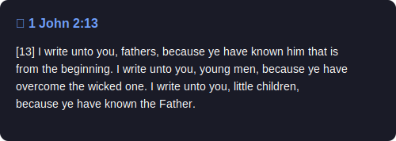

# Daily Bible Verse

Automated daily GitHub contributions with a random Bible verse.

## 📖 Today's Verse

<!-- VERSE_START -->


> **Nahum 2:3**
>
> *"[3] The shield of his mighty men is made red, the valiant men are in scarlet: the chariots shall be with flaming torches in the day of his preparation, and the fir trees shall be terribly shaken."*
<!-- VERSE_END -->

---

## Setup

1. Get a free API key from [api.bible](https://scripture.api.bible)
2. Set up the secret (see below)
3. Run manually or let GitHub Actions handle it daily

### Local Usage

```bash
# Set your API key
$env:API_BIBLE_KEY="your-api-key"  # Windows PowerShell
export API_BIBLE_KEY="your-api-key"  # Linux/Mac

# Run
npm run commit
```

### GitHub Actions (Automatic)

1. Go to repo Settings → Secrets and variables → Actions
2. Add secret: `API_BIBLE_KEY` with your API key
3. Enable Actions write permissions: Settings → Actions → General → Workflow permissions → "Read and write permissions"

The workflow runs daily at midnight UTC, or trigger manually from the Actions tab.

## History

See [contributions.json](contributions.json) for verse history.
